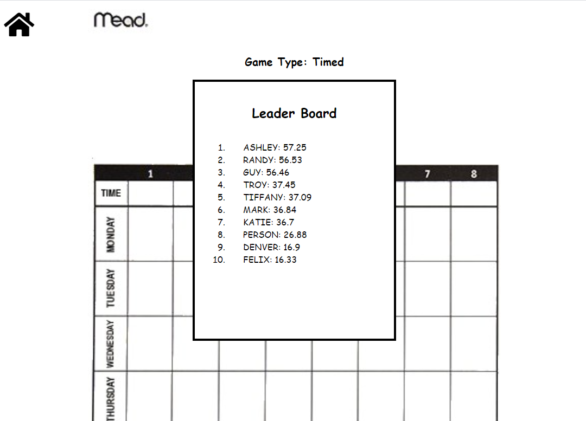
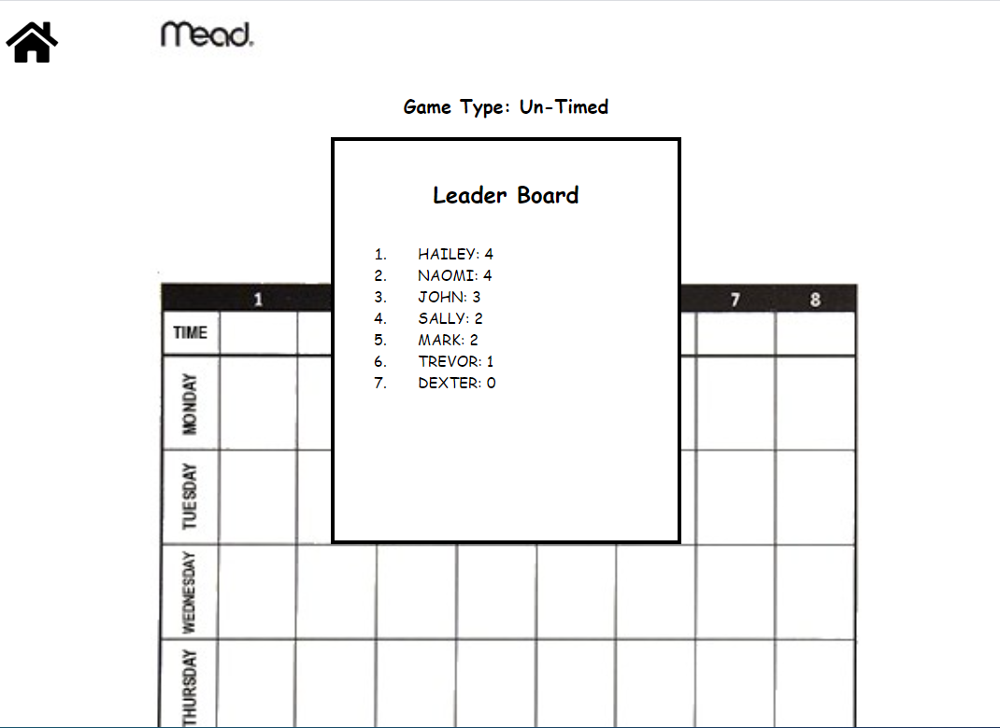

# Title
* Quiz Game

## Table of Contents
1. [General Info](#general-info)
2. [Technologies](#technologies)
3. [Installation](#installation)
4. [Usage](#usage)
5. [Collaboration](#collaboration)
6. [Deployed Site](#deployed-site)
7. [Github](#github)
8. [eMail](#email)
9. [FAQs](#faqs)

## General Info
* This is a website that offers a quiz with two game modes and shows scores at the end
* 
* 
* 
* 
* 

## Technologies
* This website was created with HTML, CSS, and Javascript code on Microsoft Visual Studio Code.

# Installation
* Go to https://github.com/tnj415/QuizGame and copy the repository on Github by clicking the green code button.
* Open your terminal, navigate to destination you want to download this repository, and run the command:
    * $ git clone https://github.com/tnj415/QuizGame.git

# Usage
* The current version of the website can be accessed at the url: https://tnj415.github.io/QuizGame/
* This website can be navigated with the links on the website

# Collaboration
* The sole developer of this website is me, Troy Johnson.

# Deployed Site
* The website can be accessed in browser at https://tnj415.github.io/QuizGame

# Github
* The Repository can be accessed on Github at https://github.com/tnj415/QuizGame

# eMail
* The best way to contact me is at tnj8510@gmail.com.

# Frequently Asked Questions
* There are no frequently asked questions.